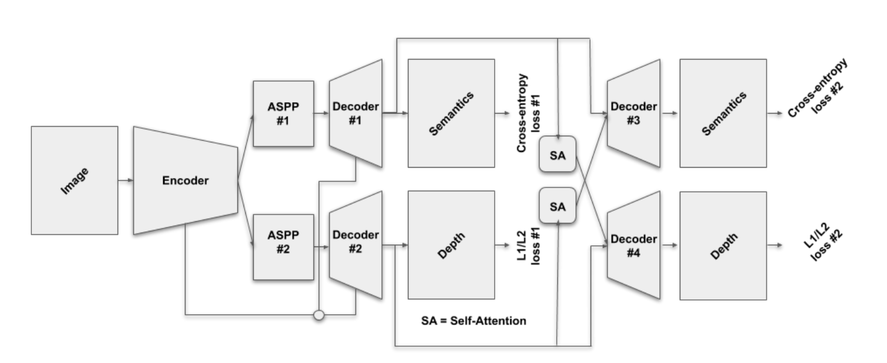

# Deep learning for autonomus driving

## Work content table
- **DLAD assignments**
    - **exercise1: Understanding Multimodal Driving Data**
    - **exercise2: Multi-task learning for semantics and depth**
    - **exercise3: 3D Object Detection from Lidar Point Clouds**

# Understanding Multimodal Driving Data

 

We use the calibration results between camera and lidar and project the lidar points to the image plane. Based on this we can annotate the lidar points with different category label.

 

Due to the motion of car itself when it receive the lidar signal back it is no longer in the original position. You can also the below figure for more details. To solve this we use the information from IMU to compensate the motion of the car.

 

You can check the results of distortion removal below. As you can see the bar in the image left is more reasonable now.

 

# Multi-task learning for semantics and depth

 

In this exercise, we will delve into Multi-Task Learning (MTL) architectures for dense prediction tasks. In particular, for semantic segmentation (i.e., the task of associating each pixel of an image with a class label, e.g., person, road, car, etc.) and monocular depth estimation (i.e., the task of estimating the per-pixel depth of a scene from a single image). 

This allows the networks to encode feature representations that are discriminative for the task at hand. In what follows, we are going to train MTL models to perform semantic segmentation and monocular depth estimation jointly.

We also explore different kinds of model distillation and its performance. Check the report for more details.

 

# 3D Object Detection from Lidar Point Clouds

 

In this exercise I work directly with irregular 3D point cloud data. I looked into one of the core problems of 3D computer vision: 3D object detection. In specific, we will be building a 2-stage 3D object detector to detect vehicles in autonomous driving scenes, i.e. to draw 3D bounding boxes around each vehicle. An object bounding box has seven degrees of freedom which need to be regressed: the center (x, y, z), the size (h, w, l) and the yaw rotation r in radians. In autonomous driving, I consider the pitch and roll to be zero as all object lie on the ground plane.

As the figure above shows I use a 2-stage detection pipeline is a common approach employed in many state-of-the-art 3D object detectors. The first stage, which is often referred to as the Region Proposal Network (RPN), is used to create coarse detection results from the irregular point cloud data. These initial detections are later refined in the second stage network to generate the final pre- dictions. The idea behind such a 2-stage design is to process the entire point cloud in the first stage and to generate regions-of-interest (ROI), i.e. smaller pools of information at and around likely objects which later can be refined individually to form the final detection

The results can be checked below:

 

